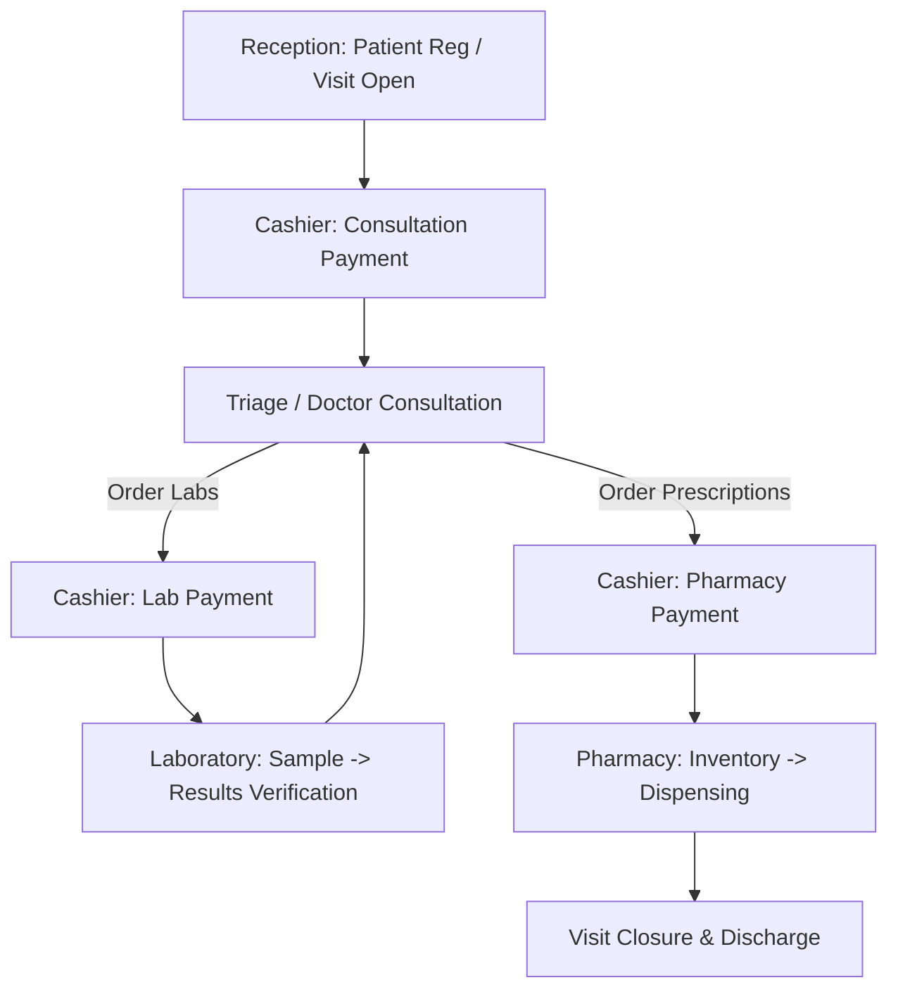

🌍 Ethiopia Clinic Management System (CMS)

<div align="center">
🏥 Enterprise Multi-Tenant Clinic Management Platform
AI-Powered Healthcare ERP for Clinics, Hospitals & Medical Centers
</div>

---

🚀 Overview

The Ethiopia Clinic Management System (CMS) is a modern enterprise-grade healthcare platform designed to digitize and streamline clinical operations from patient registration to diagnosis, laboratory services, pharmacy dispensing, billing, and reporting.

Built using a scalable SaaS architecture, the platform enables healthcare organizations to manage patient care efficiently while maintaining high standards of security, performance, and operational reliability.

Designed For:

✅ Private Clinics

✅ Medical Centers

✅ Specialty Clinics

✅ NGO Healthcare Programs

✅ Refugee Health Facilities

✅ Multi-Branch Healthcare Networks

---

✨ Key Business Benefits

### 👨‍⚕️ Clinical Efficiency
- Faster patient registration and triage logs.
- Digital Electronic Medical Records (EMR) accessible instantly.
- Intelligent consultation workflows tailored to clinician needs.
- Dramatic reduction in physical paperwork and administrative latency.

### 💰 Revenue Optimization
- Automated billing workflows for consultations, labs, and pharmacies.
- Complete payment tracking and audit trails for cashier logs.
- Multi-dimensional financial reporting and revenue analytics.

### 🧪 Laboratory Management
- Seamless lab request workflows tied directly to doctor orders.
- Safe sample tracking, collection validation, and result logs.
- Verification and approval gates to ensure data integrity.

### 💊 Pharmacy Management
- Dynamic medicine inventory control and batch expiry monitoring.
- Digital dispensing workflows with automatic stock updates.
- Real-time warning alerts for low stock items.

### 🤖 AI Clinical Assistant
Powered by Google Gemini AI:
- **Clinical summaries**: Instantly distills patient histories into actionable summaries.
- **Differential diagnosis support**: Supplies clinical validation hints to physicians.
- **Medication safety checks**: Audits prescriptions for dosing or safety risks.
- **Laboratory result interpretation**: Highlights abnormalities and reference values.
- **Pharmacy inventory insights**: Generates stock forecasting and usage trends.
- **Executive dashboard analytics**: Provides directors with operational analytics.

---

🏗️ Real Clinical Workflow

The workflow mirrors real-world clinic operations and ensures strict accountability across every department:



---

🌟 Core Features

### 👥 Patient Management
- Electronic Medical Records (EMR)
- Patient History Tracking
- Visit Management
- Medical Record Number (MRN)
- Clinical Notes
- Chronic Disease Tracking

### 🩺 Consultation Module
- Doctor Dashboard
- Diagnosis Recording
- Clinical Documentation
- Prescription Generation
- Investigation Ordering

### 💰 Billing & Finance
- Consultation Billing
- Laboratory Billing
- Pharmacy Billing
- Revenue Reports
- Payment Audit Trail

### 🧪 Laboratory Module
- Test Requests
- Sample Tracking
- Result Entry
- Result Verification
- AI-Assisted Interpretation

### 💊 Pharmacy Module
- Medicine Inventory
- Dispensing Workflow
- Low Stock Alerts
- Expiry Monitoring
- Medication Safety Analysis

### 📊 Analytics Dashboard
- Revenue Trends
- Patient Trends
- Disease Statistics
- Operational Insights
- Inventory Warnings

---

🔒 Enterprise Security

Healthcare systems require strong security controls to safeguard Protected Health Information (PHI).

### Security Highlights:
- ✅ **JWT Authentication**: Secure stateless token authentication.
- ✅ **Role-Based Access Control (RBAC)**: Strict permission boundaries for Doctors, Pharmacists, Cashiers, Nurses, and Admins.
- ✅ **Tenant Isolation**: Database queries strictly isolated per clinic context using tenant resolver context.
- ✅ **Input Sanitization**: Global Express filters to strip cross-site script (XSS) vectors.
- ✅ **XSS Protection**: Secure client and server routing gates preventing script executions.
- ✅ **Secure CORS Policies**: Whitelisted cross-origin validation parameters mapping back to verified domains.
- ✅ **Helmet Security Headers**: Hardened HTTP configurations implementing custom Content Security Policies (CSPs).
- ✅ **PHI Data Redaction**: Automatic redaction of patient names, phone numbers, and MRNs prior to AI service processing.
- ✅ **Audit Logging**: Traceable logging of critical data modifications.
- ✅ **Environment Validation**: Pre-flight checks verifying structural integrity on startup.

---

⚡ Performance Optimizations

The application has been engineered for production-scale workloads:

### Implemented Optimizations:
- **Route-based code splitting**: Eliminates single big-bundle bottlenecks.
- **React lazy loading**: Dynamically fetches chunks only when routes are accessed.
- **Database query optimization**: Resolves N+1 pricing queries via single batch select operations.
- **Bulk transaction processing**: Converts iterative row inserts into single bulk SQL operations.
- **Server-side compression**: GZIP payload compression reduces bandwidth consumption.
- **In-Memory caching**: Local caches shield database engines from repetitive static lookups.
- **Indexed database architecture**: Structured composite indexes speed up search retrieval.
- **Serverless runtime optimization**: Logging configuration automatically routes based on runtime environment.

### Results:
- 🚀 Faster Page Loads
- 🚀 Reduced Database Load
- 🚀 Improved API Response Time
- 🚀 Better Scalability
- 🚀 Lower Infrastructure Costs

---

🏛️ System Architecture

```text
Frontend (React + Vite)
        │
        ▼
Netlify CDN
        │
        ▼
Backend API (Node.js + Express)
        │
        ▼
Vercel Serverless Functions
        │
        ▼
Aiven Cloud MySQL
        │
        ▼
Google Gemini AI
```

---

🛠️ Technology Stack

| Category | Technologies |
| :--- | :--- |
| **Frontend** | React 18, Vite, Bootstrap 5 |
| **Backend** | Node.js, Express.js |
| **Database** | MySQL (Aiven Cloud) |
| **Authentication** | JWT |
| **AI Integration** | Google Gemini |
| **Hosting** | Netlify + Vercel |
| **Security** | Helmet, Sanitization, RBAC |
| **Monitoring** | Audit Logging |

---

📸 Project Highlights

### Multi-Tenant SaaS Architecture
Each clinic operates independently with isolated data and role-based access control, allowing one database cluster to serve multiple organizations securely.

### AI-Powered Healthcare Assistance
Integrated clinical intelligence supporting healthcare professionals with faster decision-making, diagnostics support, and stock optimization forecasts.

### Production Deployment
- Frontend deployed on Netlify with automated CI/CD.
- Backend deployed on Vercel utilizing performant Serverless Runtimes.
- Database hosted on Aiven Cloud with SSL integration.
- Environment validation and health monitoring included.

---

👨‍💻 Developer

### **Seid Sualih Mohammed**
*Full-Stack Web Developer*

**Specializing in:**
- Healthcare Software
- SaaS Platforms
- React Applications
- Node.js APIs
- Database Design
- AI Integration

---

📬 Contact

Available for:
- ✔ Full-Stack Development
- ✔ Healthcare Software Development
- ✔ SaaS Product Development
- ✔ API Development
- ✔ AI Integration Projects

---
*Developed with production-grade engineering principles to bring real business value to medical institutions.*
